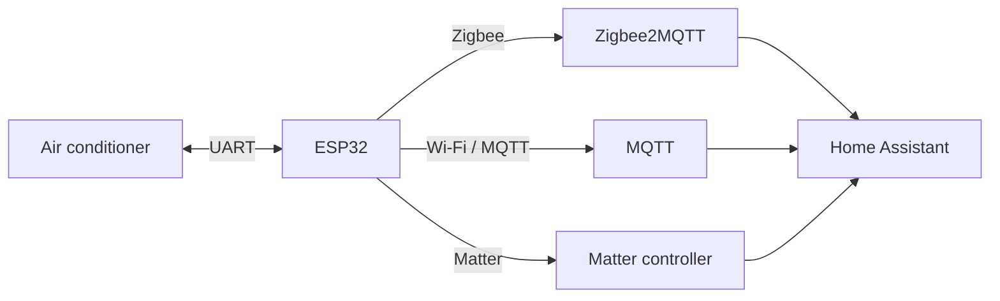

<div align="center">

<a href="https://pirogovx.ru">
  
</a>

# PirogovX ESP32 AC Controller

Local ESP32 control for air conditioners: UART, Home Assistant, Zigbee2MQTT, MQTT and Matter.

**English** | [Русский](README_RU.md)

[](https://flash.pirogovx.ru)
[](LICENSE)
[](https://www.espressif.com/)
[](https://www.home-assistant.io/)

<br>

[](https://t.me/pirogovc)
[](https://www.youtube.com/@pirogovx)
[](https://www.instagram.com/pirogovx/)

</div>

> [!IMPORTANT]
> **This GitHub repository is not a mirror of every firmware profile available from PirogovX.**
>
> The source code here is primarily an open-source reference implementation for **Midea / Midea OEM UART devices**, together with Zigbee, Matter and Wi-Fi examples.
>
> For the newest **universal firmware**, broader device compatibility and browser flashing, use **[flash.pirogovx.ru](https://flash.pirogovx.ru)**. The universal ESP32-C6 firmware supports automatic protocol detection for multiple AC platforms, including Midea, TCL, Haier, Hisense RS-485, Gree and Samsung NASA F1/F2.
>
> Protocol and model support evolves quickly, so the website should be treated as the current compatibility source.

## Why this project exists

Many Midea and Midea-OEM air conditioners expose a local UART interface to the original Wi-Fi module. This project replaces that module with an ESP32 and keeps control local.

No vendor cloud is required for the basic control path.



## What is included in this repository

Ready-to-build / ready-to-flash variants currently include:

| Variant | Board | Integration | Notes |
|---|---|---|---|
| Wi-Fi | ESP32-C6 | MQTT / WQTT | Local web setup, OTA |
| Wi-Fi | ESP32-C3 | MQTT / WQTT | Local web setup, OTA |
| Zigbee | ESP32-C6 | Zigbee2MQTT / Home Assistant | Router, OTA, factory reset |
| Zigbee | ESP32-H2 | Zigbee2MQTT / Home Assistant | Router, OTA, factory reset |
| Matter | ESP32-C6 | Matter | Local Matter integration |

All variants communicate directly with the air conditioner's internal UART instead of the original USB Wi-Fi module.

## GitHub firmware vs universal PirogovX firmware

| | This GitHub repository | PirogovX universal firmware |
|---|---|---|
| Main purpose | Open-source development, protocol research, contributions | Broad end-user compatibility |
| Main protocol focus | Midea / Midea OEM UART | Multi-protocol |
| Firmware delivery | Source + files in `release/` | Browser installer |
| Protocol selection | Build/profile dependent | Automatic detection on supported universal builds |
| Current broader protocol families | Not all are included here | Midea, TCL, Haier, Hisense RS-485, Gree, Samsung NASA F1/F2 |
| Best choice for | Developers, contributors, testing | Users who want the widest supported model range |

**Universal installer:** [flash.pirogovx.ru](https://flash.pirogovx.ru)

## Features

- Power on / off
- HVAC modes: auto, cool, heat, dry, fan only
- Target temperature
- Fan speeds: auto, low, medium, high, quiet
- Horizontal and vertical swing
- Presets: none, sleep, turbo
- Display / beep control where supported by the AC firmware
- Indoor temperature telemetry
- Outdoor temperature telemetry where exposed by the AC
- Local operation without the original vendor Wi-Fi module
- OTA updates on supported builds
- Zigbee router operation on Zigbee builds

### Wi-Fi builds

Additional features include:

- captive portal for initial setup
- MQTT / WQTT integration
- OTA
- local web interface
- configurable TX/RX pins on supported builds

### Zigbee builds

Additional features include:

- Zigbee Router mode
- Zigbee2MQTT integration
- OTA through Zigbee2MQTT
- BOOT button factory reset
- current and outdoor temperature telemetry in Home Assistant

## Compatibility

The source implementation in this repository targets air conditioners using the **Midea UART protocol** and compatible OEM implementations.

Typical compatibility indicators:

- original module is similar to **OSK102 / OSK103 / OSK104 / OSK105 / OSK302 / SK10x / SK11x**
- the original app is **NetHome Plus**, **Midea Air**, **MSmartHome**, **Hommyn Home** or another Midea-based app
- the indoor unit has a USB-A or 4-wire UART connector for its Wi-Fi module

Known / tested examples include:

- Royal Clima RCI-TWA22HN TRIUMPH
- Kentatsu KSGYK35HZRN1 / KSRYK35HZRN1
- Kentatsu KSGA26HZRN1
- Hommyn models based on Midea / Syncleo
- Neoline NAM 07HN1

Many other Midea OEM brands may work as well.

> [!NOTE]
> Some older OSK103 / Royal Clima implementations require the display button to be pressed seven times before communication is enabled and use a legacy `0x64` handshake. A dedicated firmware profile is available on the web installer.

## Wiring

Typical wiring:

```text
Air conditioner 5V   -> ESP 5V
Air conditioner GND  -> ESP GND
Air conditioner TX   -> ESP RX
Air conditioner RX   -> ESP TX
```

> [!WARNING]
> ESP32 GPIO uses 3.3 V logic. Some air conditioners may expose 5 V UART levels. Use a proper level shifter where required, especially from AC TX to ESP RX.

### Wi-Fi ESP32-C6

```text
GPIO6 = TX -> AC RX
GPIO7 = RX <- AC TX
UART  = 9600 baud
```

### Wi-Fi ESP32-C3

```text
GPIO20 = TX -> AC RX
GPIO21 = RX <- AC TX
UART   = 9600 baud
```

### Zigbee ESP32-C6

```text
GPIO7 = TX -> AC RX
GPIO6 = RX <- AC TX
UART  = 9600 baud
```

### Zigbee ESP32-H2

```text
GPIO5 = TX -> AC RX
GPIO8 = RX <- AC TX
UART  = 9600 baud
```

## Browser flashing

The easiest installation path is the PirogovX browser flasher:

### **[Open flash.pirogovx.ru](https://flash.pirogovx.ru)**

It supports Web Serial in compatible Chromium-based browsers and provides firmware profiles for multiple boards and air conditioner platforms.

The website also contains the broader compatibility database and universal multi-protocol firmware that is **not fully represented by this repository**.

## Release files

Prebuilt files in this repository are located under:

```text
release/
  wifi-esp32c6/
  wifi-esp32c3/
  zigbee-esp32c6/
  zigbee-esp32h2/
  matter-esp32c6/
```

Example for Zigbee ESP32-H2:

```powershell
esptool.py --chip esp32h2 -p COM11 -b 460800 --before default_reset --after hard_reset write_flash --flash_mode dio --flash_freq 48m --flash_size 2MB 0x0 bootloader.bin 0x8000 partition-table.bin 0xf000 ota_data_initial.bin 0x20000 zb_midea_ac.bin
```

Replace `COM11` with your serial port.

## Zigbee2MQTT

The Zigbee device identifies as:

```text
PirogovX / ZB-MIDEA-AC
```

The external converter is available in the repository:

```text
zigbee2mqtt/esp-ac.js
```

or in the corresponding release directory.

Relevant upstream submissions:

- [zigbee-herdsman-converters #12918](https://github.com/Koenkk/zigbee-herdsman-converters/pull/12918)
- [zigbee2mqtt.io #5414](https://github.com/Koenkk/zigbee2mqtt.io/pull/5414)

### Zigbee OTA

Example Zigbee2MQTT configuration:

```yaml
ota:
  zigbee_ota_override_index_location: https://flash.pirogovx.ru/firmware/ota-zigbee/index.json
```

Then use **OTA -> Check for new updates -> Update** in Zigbee2MQTT.

## ZHA

The current repository is focused on Zigbee2MQTT. Native ZHA device handling is not part of the main implementation yet.

ZHA support is a welcome contribution. For true out-of-the-box Home Assistant ZHA support, the final device quirk should also be contributed upstream to `zigpy/zha-device-handlers`.

## Project structure

```text
main/
  main.cpp            - Zigbee logic: router, OTA client, factory reset
  midea.cpp / midea.h - Midea UART protocol
  zb_signal_handler.c - Zigbee signal handling

zigbee2mqtt/
  esp-ac.js           - Zigbee2MQTT external converter

release/
  wifi-esp32c6/
  wifi-esp32c3/
  zigbee-esp32c6/
  zigbee-esp32h2/
  matter-esp32c6/
```

## Contributing

Contributions are welcome.

Good candidates include:

- additional Midea / OEM compatibility
- UART protocol fixes
- ZHA quirks
- IR Follow Me support
- additional hardware testing
- documentation
- translations

For larger features, keeping changes in a focused feature branch and opening a separate pull request for each feature makes review and hardware testing easier.

## Safety

- Never connect the ESP32 directly to mains voltage.
- Power it only from a verified low-voltage supply.
- Verify 5 V and GND before wiring.
- Never short TX/RX to a power rail.
- Use level shifting if UART voltage levels are uncertain.
- Disconnect mains power from the air conditioner before installing or removing hardware.

## License

The main project code is licensed under the **Apache License 2.0**.

Commercial use, modification and redistribution are allowed under the terms of the license, including use in commercial hardware modules.

The **PirogovX** project/product name is not licensed as a trademark or commercial brand by the Apache software license.

See:

- [LICENSE](LICENSE)
- [NOTICE](NOTICE)
- [THIRD_PARTY_NOTICES.md](THIRD_PARTY_NOTICES.md)

## Credits

The Midea UART implementation was developed with reference to publicly available open-source work, including:

- [midea-msmart](https://github.com/0xbw/midea-msmart)
- [MideaUART](https://github.com/dudanov/MideaUART)

See [THIRD_PARTY_NOTICES.md](THIRD_PARTY_NOTICES.md) for attribution details.

---

<div align="center">

**PirogovX**

Local-first ESP32 integrations for air conditioners and smart home systems.

[Web installer](https://flash.pirogovx.ru) · [Русский README](README_RU.md)

</div>
